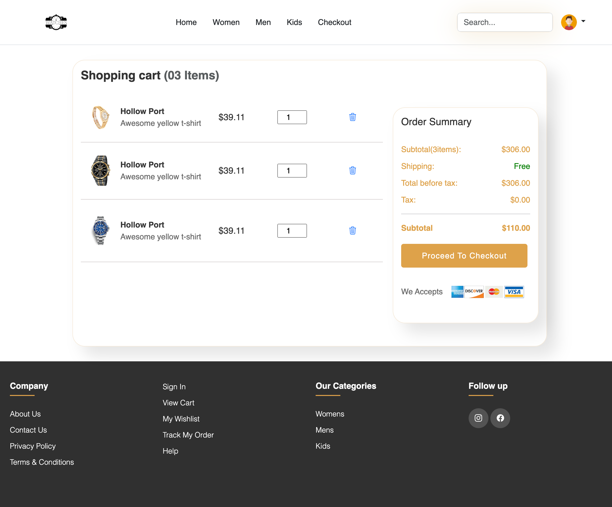
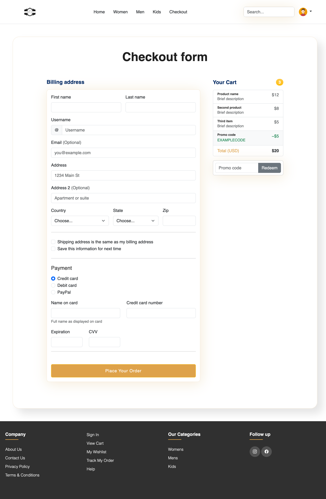
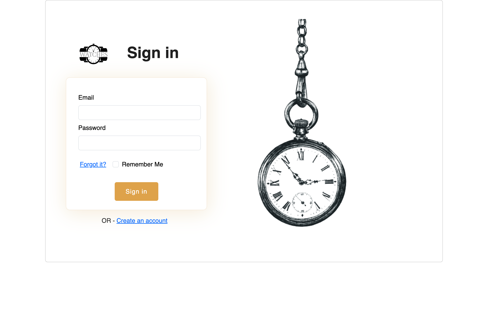

# Modern E-Commerce Website

This repository contains the code for a modern e-commerce platform designed using HTML, CSS, and Bootstrap. The project showcases an intuitive and responsive design, optimized for an excellent user experience across all devices.

## Features

- **Responsive Design**: Built with Bootstrap to ensure that the website is accessible on all devices, from phones to desktops.
- **User-Friendly Interface**: Simple, clean interface that allows users to navigate the website effortlessly.
- **Secure Checkout System**: Implements a secure and straightforward checkout process.

## Demo

Explore the functionality of this e-commerce platform by visiting: [E-Commerce](https://timeforbuy.netlify.app/)

## Contact
For any inquiries or issues, please open an issue on the repository or contact aaungdev@outlook.com